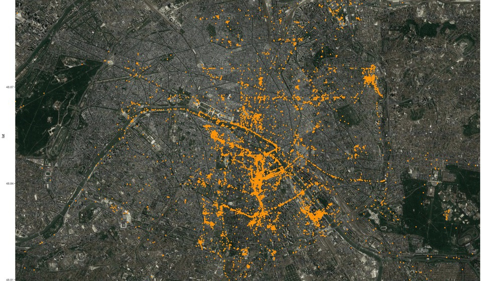
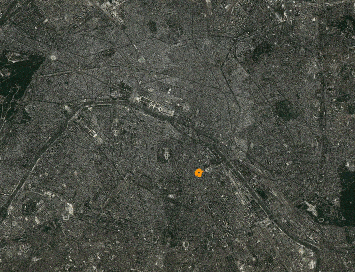

# exploring-my-neighborhood

- cron that run findme.py every 10 minutes
- plot with [https://github.com/dkahle/ggmap](https://github.com/dkahle/ggmap)
- few fixes with imagemagick

[reddit thread](https://www.reddit.com/r/dataisbeautiful/comments/a8l2jv/oc_two_years_of_exploring_my_neighborhood_on_foot/)

GIF (3.4mb):

wtfpl

